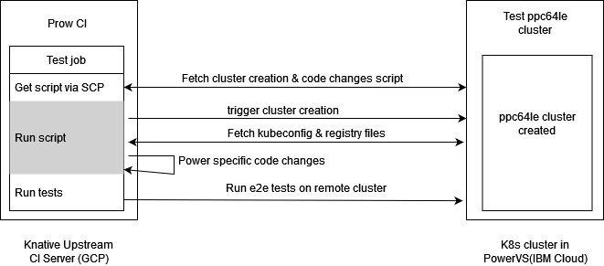

# Knative Upstream CI
Automation, configurations, scripts &amp; documentation on Knative Upstream CI on Power.

### Test flow 



Explaination: https://ibm.box.com/s/jadfn2jsh4ans1pbp167g3ctbxn0sa0j

### Prerequisites

- RHEL/Centos precreated vms at PowerVS.
- Access to GCP secret manager service.

### Setup

- Clone the repo in `/opt/` directory on bastion. 
    Cloning the directory at any other loaction will require update in `$BASE_DIR` var in `setup-environment.sh` and in upstream test configurations in [knative/test-infra](https://github.com/knative/test-infra).
    ```bash
    cd /opt
    git clone https://github.ibm.com/ppc64le-automation/knative-upstream-ci
    cd knative-upstream-ci
    
    # clone k8s automation submodule
    git submodule init
    git submodule update
    ```
- Setup the k8s automation
    - Create `k8s-automation/hosts.yml` with node details. 
        Refer [k8s-automation/hosts-sample.yml](./k8s-automation/hosts-sample.yml) file.
    - Create `k8s-automation/env.yml` with other details. 
        Refer [k8s-automation/env-sample.yml](./k8s-automation/env-sample.yml) file.
- Add/update cluster details on upstream server via GCP.
    Refer [gcp-secret-manager.md](./docs/gcp-secret-manager.md).
- Create upstream CI jobs in `knative/test-infra` repo.

### Add new jobs

Refer [adjustment-scripts.md](./docs/adjustment-scripts.md) to add new `adjust.sh` script and [testing.md](./docs/testing.md) to add & test the job configurations.